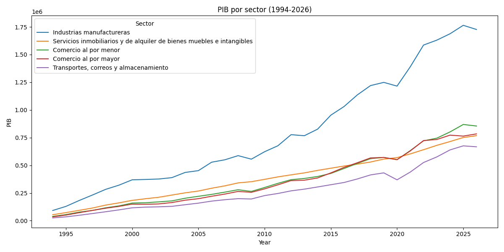

<!DOCTYPE html>
<html lang="es">
<head>
<meta charset="UTF-8">
<meta name="viewport" content="width=device-width, initial-scale=1.0">
<title>Análisis del PIB de México por Sector Económico (1994–2026)</title>

</head>
<body>

  <h1>📊 Análisis del PIB de México por Sector Económico (1994–2026)</h1>

  

    Este proyecto consiste en un <strong>análisis exploratorio de datos (EDA)</strong> del
    Producto Interno Bruto de México desagregado por <strong>20 sectores económicos</strong>
    (clasificación SCIAN), con series anuales de 1994 a 2026 (33 años, 660 observaciones).
    El objetivo es identificar los sectores de mayor magnitud en la economía mexicana y
    describir su evolución temporal, utilizando <strong>Python</strong> con las librerías
    <strong>pandas</strong> y <strong>matplotlib</strong>.
  

  

  <h2 style="color:#2980b9;">🛠️ Herramientas utilizadas</h2>
  <ul>
    <li><strong>Python</strong> – lenguaje principal del análisis</li>
    <li><strong>pandas</strong> – carga, validación, transformación y análisis de datos</li>
    <li><strong>matplotlib</strong> – visualización de series temporales</li>
    <li><strong>INEGI</strong> – fuente oficial de los datos</li>
  </ul>

  

  <h2 style="color:#2980b9;">📚 Fuente de datos</h2>
  <ul>
    <li><strong>Instituto Nacional de Estadística y Geografía (INEGI)</strong> – dataset de PIB por sector.</li>
    <li>Cobertura: 20 sectores, clasificación SCIAN a nivel sector, 1994–2026.</li>
  </ul>
  

    <strong>Pendiente de documentar antes de publicar:</strong>
    (1) nombre exacto del dataset y enlace de descarga en el BIE, con fecha de descarga;
    (2) unidades y naturaleza de la serie (nominal vs. precios constantes, año base);
    (3) origen de la observación de 2026 (¿cifra oficial, estimación o proyección?).
  

  

  <h2 style="color:#2980b9;">🔍 Metodología</h2>
  <ol>
    <li><strong>Carga y validación del dataset</strong> (660 registros, 20 sectores, 33 años): verificación de duplicados en la clave (año, sector) y de valores faltantes. No se encontraron registros duplicados ni valores nulos.</li>
    <li><strong>Transformación</strong> del formato largo a formato ancho con <code>pivot</code>, estructurando las series temporales con años como índice y sectores como columnas.</li>
    <li><strong>Selección de los sectores de mayor magnitud</strong> con dos criterios reportados por separado: promedio del periodo 1994–2026 y valor del año más reciente (2025). El top 5 por promedio es: industrias manufactureras, servicios inmobiliarios y de alquiler, comercio al por menor, comercio al por mayor, y transportes/correos/almacenamiento. En 2025 el orden es: manufactureras (1,764,429), comercio al por menor (868,893), comercio al por mayor (764,043), inmobiliarios (751,363) y transportes (675,834), en las unidades del dataset.</li>
    <li><strong>Indicadores descriptivos</strong>: participación porcentual de cada sector sobre la suma de los 20 sectores y tasa de crecimiento anual compuesto nominal (CAGR) 1994–2025. La participación se calcula sobre la suma de sectores, no sobre el PIB total (que incluye impuestos menos subsidios y otros rubros).</li>
    <li><strong>Visualización</strong> de las series históricas de los 5 sectores seleccionados con gráfico de líneas.</li>
  </ol>

  

  <h2 style="color:#2980b9;">📈 Resultados</h2>
  
  
Figura 1. Evolución del PIB de los 5 sectores de mayor magnitud, 1994–2026.
  Fuente: INEGI (dataset exacto pendiente de documentar). Elaboración propia.

  
Participación por sector sobre la suma de los 20 sectores y CAGR nominal 1994–2025
  (top 5 por magnitud):

  <table>
    <tr><th>Sector</th><th>Participación 1994</th><th>Participación 2025</th><th>CAGR nominal</th></tr>
    <tr><td>Industrias manufactureras</td><td>20.6%</td><td>21.4%</td><td>10.0%</td></tr>
    <tr><td>Comercio al por menor</td><td>8.6%</td><td>10.5%</td><td>10.6%</td></tr>
    <tr><td>Comercio al por mayor</td><td>7.8%</td><td>9.3%</td><td>10.5%</td></tr>
    <tr><td>Servicios inmobiliarios y de alquiler</td><td>12.1%</td><td>9.1%</td><td>8.9%</td></tr>
    <tr><td>Transportes, correos y almacenamiento</td><td>5.6%</td><td>8.2%</td><td>11.2%</td></tr>
  </table>
  
Los 5 sectores de mayor magnitud concentraron 55.7% de la suma sectorial en 1994 y 58.6% en 2025.

  

  <h2 style="color:#16a085;">💡 Principales hallazgos</h2>
  <ol>
    <li><strong>Las industrias manufactureras son el sector de mayor magnitud en todo el periodo.</strong>
    En 2025 alcanzaron 1,764,429 (unidades del dataset), su nivel máximo en la serie, equivalente a
    2.03 veces el del segundo sector (comercio al por menor). No obstante, su participación se mantuvo
    prácticamente estable (20.6% en 1994 frente a 21.4% en 2025), por lo que los datos no respaldan
    que su peso relativo se haya ampliado de forma significativa en tres décadas.</li>
    <li><strong>El impacto de la pandemia en 2020 fue heterogéneo.</strong> Trece de los veinte sectores
    registraron contracciones, concentradas en actividades de contacto: esparcimiento cultural y
    deportivo (−39.4%) y alojamiento y preparación de alimentos (−37.0%). En contraste, agricultura
    (+7.3%), salud (+9.3%), servicios gubernamentales (+5.1%) e inmobiliarios (+2.3%) crecieron,
    lo cual es consistente con la continuidad de actividades esenciales y el comportamiento
    contracíclico de algunos servicios públicos. Las manufactureras cayeron 2.7%, una magnitud menor
    que en la crisis financiera internacional de 2009 (−5.4%).</li>
    <li><strong>La recuperación de 2021 fue generalizada, aunque no universal.</strong> La minería no
    recuperó su nivel de 2019 (260,452) hasta 2022.</li>
    <li><strong>Otros episodios relevantes:</strong> la caída de la minería en 2015 (−37.4% respecto a
    2014, asociada al desplome de los precios internacionales del petróleo) y en 2009 (−25.7%),
    lo que sugiere que es el sector del top 5 con mayor exposición a choques externos.</li>
    <li><strong>Los servicios inmobiliarios presentan una trayectoria monótona creciente:</strong>
    es el único sector del top 5 sin una sola contracción anual en 1994–2026, aunque con un CAGR
    (8.9%) inferior al de comercio y transportes. Comercio al por menor superó a inmobiliarios en
    magnitud a partir de 2017.</li>
    <li><strong>En 2026 once de los veinte sectores muestran contracciones</strong> respecto a 2025
    (manufactureras −2.1%, agricultura −8.7%, energía −9.8%), mientras minería (+16.2%), servicios
    gubernamentales (+5.8%) y financieros (+4.3%) crecen. Dado que el origen del dato 2026 está
    pendiente de documentar, esta observación debe interpretarse con cautela.</li>
  </ol>

  

  <h2 style="color:#8e44ad;">📊 Conclusión</h2>
  

    El análisis describe una economía con un sector manufacturero de mayor magnitud y con participación
    estable en la suma sectorial (~21%), acompañado por un bloque de servicios —comercio, transportes
    e inmobiliarios— que aumentó su concentración conjunta de 55.7% a 58.6% entre 1994 y 2025. La
    crisis de 2020 afectó de manera desigual a los sectores, con las contracciones más profundas en
    actividades de contacto, y la recuperación posterior fue generalizada con excepciones (minería).
    Estos resultados son consistentes con una economía diversificada, aunque —por tratarse de cifras
    nominales y de un análisis descriptivo— no permiten afirmar conclusiones sobre crecimiento real
    ni relaciones causales.
  

  

  <h2 style="color:#c0392b;">⚠️ Limitaciones</h2>
  <ul>
    <li>Las cifras corresponden a valores <strong>nominales</strong> (pendiente de confirmar contra la
    ficha técnica del INEGI): el crecimiento observado combina el efecto de precios y volúmenes, y los
    CAGR no deben interpretarse como crecimiento real.</li>
    <li>La participación porcentual se calcula sobre la suma de los 20 sectores, no sobre el PIB total
    de la economía.</li>
    <li>El análisis es descriptivo: no se realizan pruebas estadísticas ni inferencia causal.</li>
    <li>La observación de 2026 requiere documentación adicional sobre su origen (estimación, proyección
    o dato oficial).</li>
  </ul>
  

    <strong>Trabajo futuro:</strong> deflactar la serie (INPC o deflactores sectoriales del INEGI)
    para obtener crecimiento a precios constantes; replicar el análisis con series trimestrales;
    pronósticos con modelos de series temporales (ARIMA/SARIMA, Prophet) sobre series reales; y
    comparación de la estructura sectorial con otras economías de la OCDE.
  

  

  <h2 style="color:#2980b9;">🚀 Cómo ejecutar el proyecto</h2>
  <ol>
    <li>Clona el repositorio:</li>
  </ol>
  <pre><code>git clone https://github.com/tu-usuario/analisis-pib-mexico-sectores.git</code></pre>
  <ol start="2">
    <li>Instala las dependencias:</li>
  </ol>
  <pre><code>pip install pandas matplotlib</code></pre>
  <ol start="3">
    <li>Ejecuta el script:</li>
  </ol>
  <pre><code>python analisis-pib-mexico-sectores.py</code></pre>

  

  <h2 style="color:#16a085;">👤 Autor</h2>
  

    Eduardo Fabián Vidaca Araujo –
    <a href="https://www.linkedin.com/in/eduardo-fabian-vidaca-araujo-it-engineer/" style="color:#2980b9;">LinkedIn</a> –
    eduardovidaca2022@gmail.com
  

</body>
</html>
